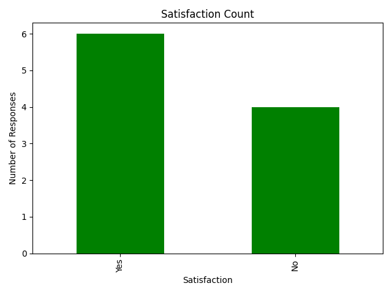
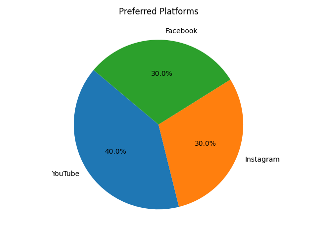
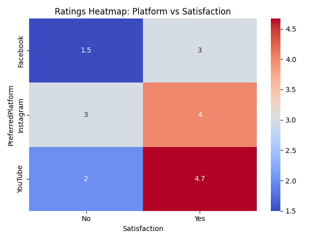

# 📝 Project 8: Survey Data Visualization

## 🎯 Objective
To analyze and visualize survey data including platform preferences, satisfaction, and ratings.

## 🛠️ Tools Used
- Python
- pandas
- matplotlib
- seaborn

## 📁 Dataset
- Fields: Respondent ID, Preferred Platform, Satisfaction, Rating

## 📊 Visualizations
- Bar chart: Satisfaction count
- Pie chart: Preferred platforms
- Heatmap: Ratings by Platform and Satisfaction

## 📸 Output
  
  

## 👩‍💻 Author
Suparna Chaudhari
